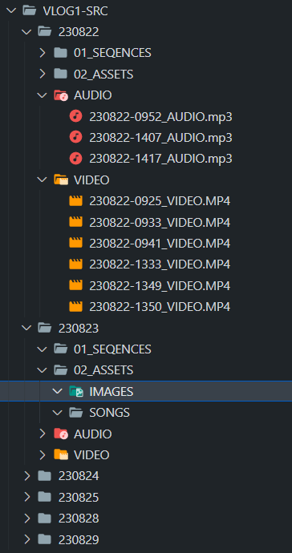

# Setup your video editing environement

> This app streamlines the preparation of your files for post-production video editing. 

It automates the sorting and renaming of your media assets, making your editing workflow more efficient. 

Simply choose your source folder, a name, and let the app organize and rename your files"

  

